# Train Reservation System

A full-stack Java web application for train search, booking, cancellation, and admin management — built with **JSP, Servlets, JDBC, and MySQL**, following the **MVC2 architecture**, with a real, working **multithreaded booking/waitlist engine** underneath.

This isn't just a CRUD demo — it models real-world reservation behavior: per-seat concurrency locking, an automatic waitlist that promotes passengers the moment a seat is cancelled (IRCTC-style), audited train changes, and paginated admin views.

---

## ✨ Features

### For Passengers
- Register / login / logout with session management
- Search trains by source & destination station
- Live seat availability per journey date
- Book a ticket with seat selection and simulated payment (UPI / Card / Net Banking)
- **Automatic waitlist**: if a train is full, join the waitlist instead of being turned away — get auto-promoted to `CONFIRMED` the instant a seat is cancelled, keeping your own PNR the whole time
- View, download (printable ticket), and cancel bookings — paginated booking history
- Dashboard with booking status distribution (donut chart) and live countdown to next journey
- Edit profile (name / email / phone) and change password independently

### For Admins
- Dashboard with system stats, revenue/booking bar & donut charts, and **live concurrency metrics**
- Add / update / deactivate trains, with full audit history (who changed what, when, and whether it was an activation, deactivation, or a plain update)
- Per-date seat layout viewer with a date picker (auto-refreshes on date change)
- Search bookings by PNR, view passenger details, cancel bookings — paginated bookings table
- Manage users (activate/deactivate), view per-user login history — paginated users table
- Generate system reports via a **parallel ForkJoinPool** job (revenue, bookings, passengers, trains computed concurrently)

---

## Concurrency Design (the interesting part)

This project deliberately uses Java's concurrency utilities as real infrastructure, not decoration:

| Mechanism | Where | What it does |
|---|---|---|
| `ReentrantLock` (fair, per-seat) | `ConcurrencyService` | Every booking/promotion locks on `seatId_journeyDate` — so two different seats on the same train can be booked in parallel, but two requests for the *same* seat+date genuinely queue and serialize |
| `UNIQUE` DB constraint | `seat_reservation` table | A second, unbreakable layer of protection — even if the app-level lock were bypassed, MySQL itself rejects a duplicate active seat assignment |
| `BlockingQueue` + `ExecutorService` (virtual threads) | `ConcurrencyService` | Waitlist promotions are queued as real jobs and processed by dedicated worker threads, not called inline |
| `ForkJoinPool` | `ConcurrencyService.generateAllReportsParallel()` | Revenue / booking / passenger / train reports are computed as 4 parallel `RecursiveTask`s instead of sequentially |
| `AtomicInteger`, `ConcurrentHashMap` | `ConcurrencyService` | Thread-safe counters and route-search caching, surfaced live on the Admin Dashboard |

### The waitlist, concretely
1. A train fills up → the seat dropdown disables and a **"Join Waitlist"** option appears.
2. Joining creates a real `WAITING` booking with its own PNR immediately (matches IRCTC's behavior: waitlisted passengers already have a PNR, not a placeholder).
3. When any confirmed booking on that train+date is cancelled, the system automatically looks up the oldest waiting passenger and promotes **their own PNR** to `CONFIRMED`, assigning them the freed seat — no manual intervention.
4. Promotion runs through the same virtual-thread queue as regular bookings, so it's visible in the Concurrency Metrics panel while it happens.

---

## Architecture — MVC2
JSP (View) → Servlet (Controller) → POJO (Model) → OperationImpl (DAO) → MySQL (Stored Procedures)
↓
ConcurrencyService (Service layer: locking, caching, thread pools)


- **Controllers**: `UserServlet`, `AdminServlet` — handle requests, never touch JDBC directly
- **Models**: `UserPojo`, `TrainPojo`, `AdminPojo`, `ReportPojo` — expose business methods that delegate to their Operation layer
- **Operation / Impl layer**: `UserOperationImpl`, `TrainOperationImpl`, `AdminOperationImpl`, `ReportOperationImpl` — the only place JDBC code lives
- **Service layer**: `ConcurrencyService` — coordinates locking/caching *around* the Operation layer, called directly by Controllers
- **Database**: MySQL, entirely via stored procedures/functions/triggers — no inline business SQL in Java except `getAllTrains()`'s simple SELECT

---

##  Tech Stack

- **Backend**: Java, Servlets, JSP, JDBC
- **Database**: MySQL (stored procedures, functions, triggers, events)
- **Server**: Apache Tomcat 8.5
- **Frontend**: HTML, CSS (custom dark theme), vanilla JavaScript, Chart.js
- **Logging**: `java.util.logging` with a custom auto-flushing rotating file handler
- **Concurrency**: `java.util.concurrent` (ReentrantLock, ForkJoinPool, ExecutorService/virtual threads, BlockingQueue, AtomicInteger, ConcurrentHashMap)

---

## 📸 Screenshots

| | |
|---|---|
| **Admin Dashboard** |  |
| **Admin Login** | 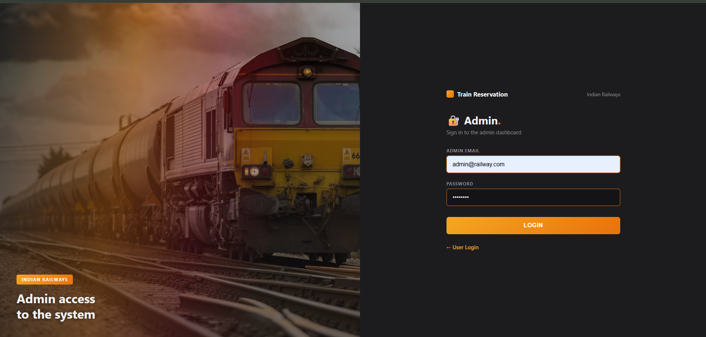 |
| **Admin Profile** | 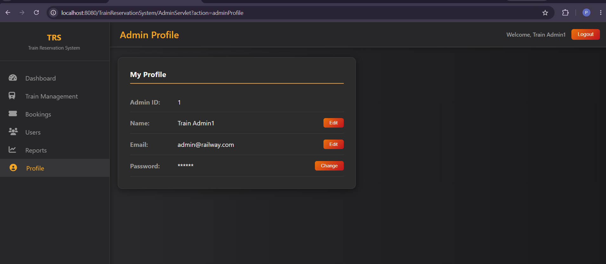 |
| **Bookings** | 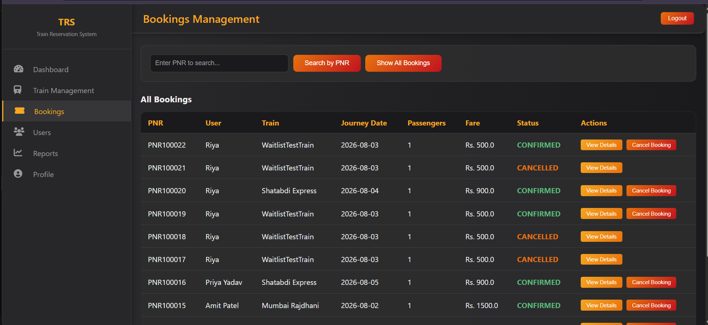 |
| **Booking Successful** | 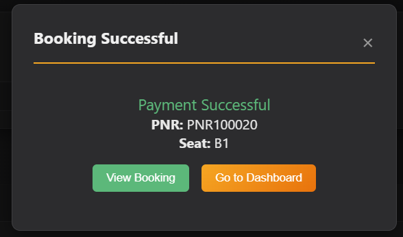 |
| **Booking Ticket** | 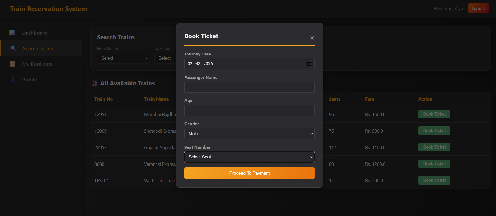 |
| **My Bookings** | 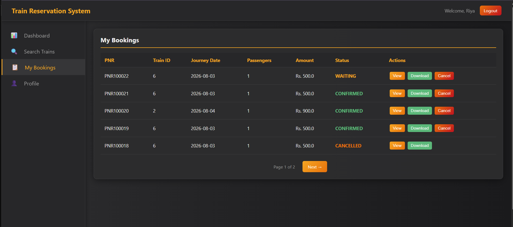 |
| **Register** | 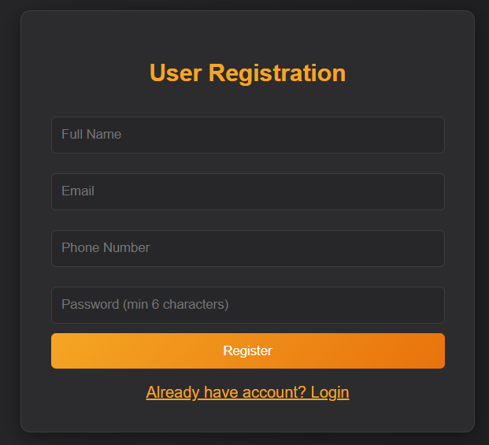 |
| **Reports** | 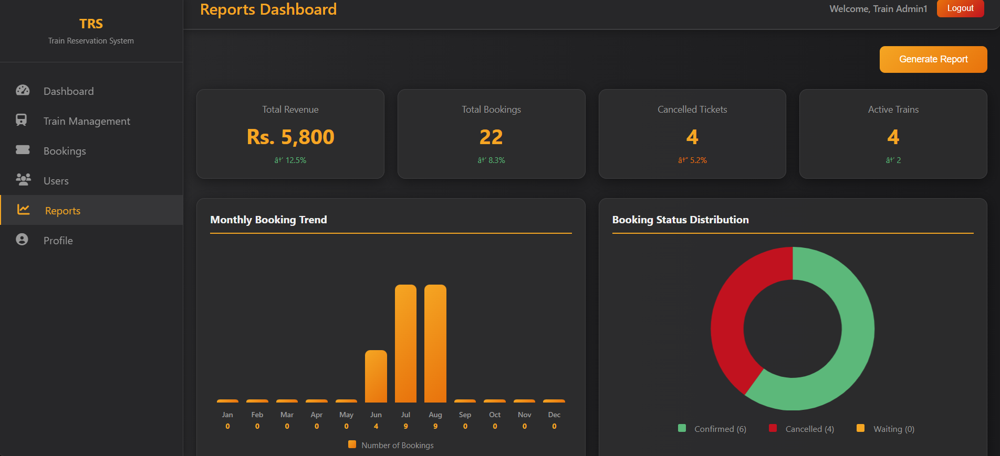 |
| **Search Train** | 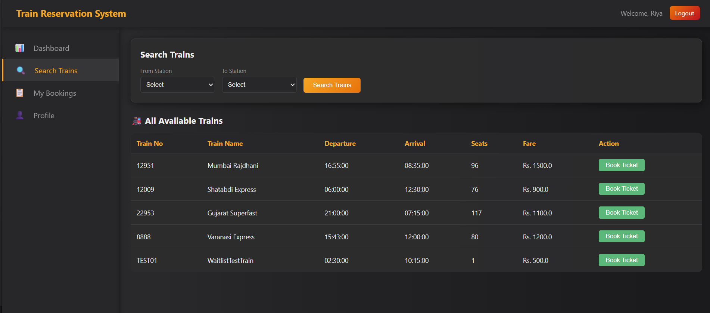 |
| **Train History** | 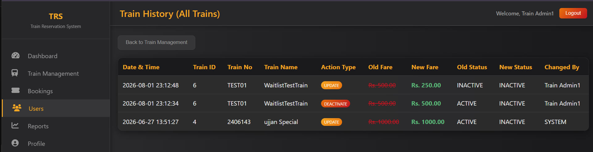 |
| **Train Management** | 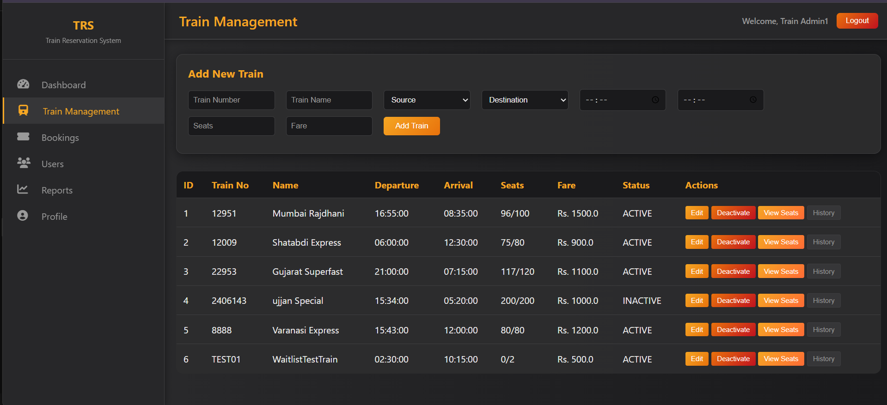 |
| **User Dashboard** | 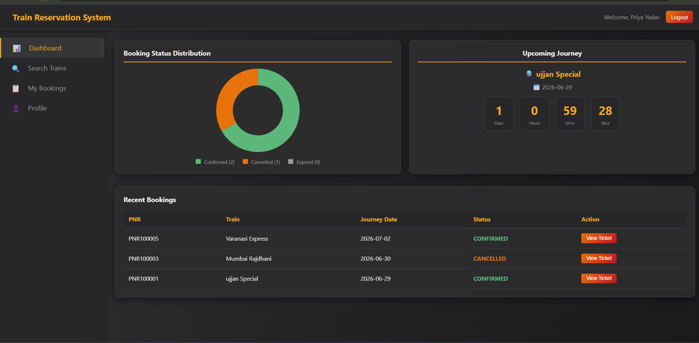 |
| **User Login** | 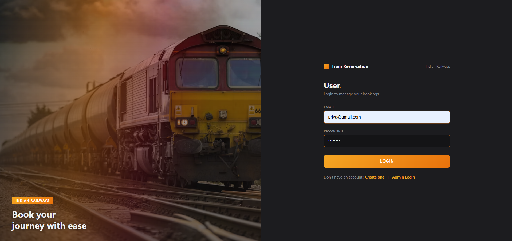 |
| **User Profile** | 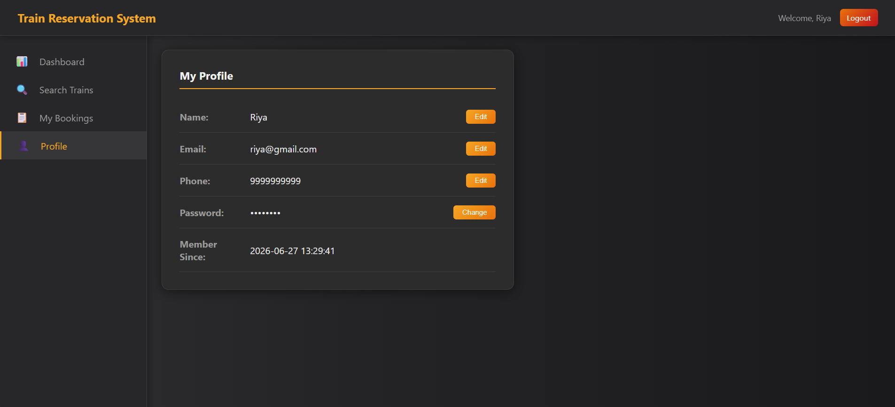 |
| **Users List** | 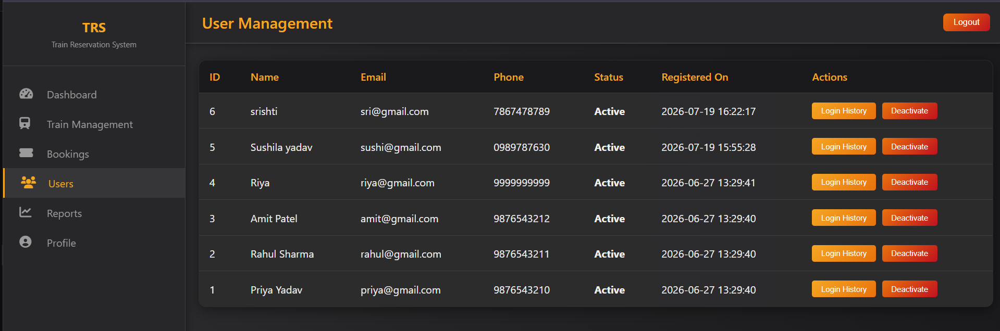 |
| **View Seats** | 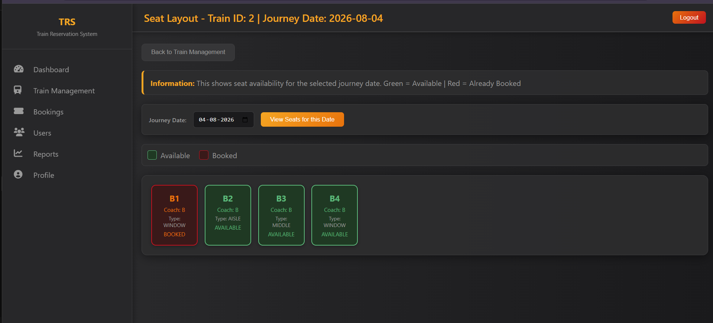 |
| **Waiting List** | 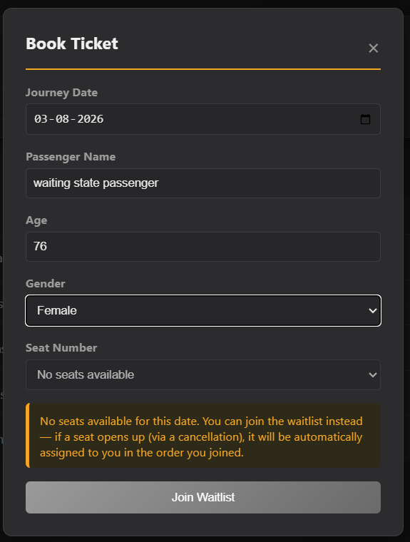 |
##  Setup & Installation

### Prerequisites
- JDK 17+ (project uses virtual threads — JDK 21 recommended)
- Apache Tomcat 8.5+
- MySQL 8.0+
- Eclipse IDE (or any IDE with Dynamic Web Project + Tomcat support)

### Steps

1. **Clone the repo**
```bash
   git clone https://github.com/priyayadav020107-wq/TrainReservationSystem.git
```

2. **Set up the database**
   - Open MySQL Workbench (or CLI).
   - Run the full schema script (tables, procedures, functions, triggers, events, seed data) from `/database/schema.sql`.
   - Run any patch scripts in `/database/patches/` in order (these contain later fixes: seat-availability tracking, waitlist procedures, pagination procedures, and the active-seat uniqueness fix).

3. **Configure the DB connection**
   - Open `src/db_config/GetConnection.java` and update the URL, username, and password to match your local MySQL instance.

4. **Import into Eclipse**
   - File → Import → Existing Projects into Workspace → select this folder.
   - Add any required JDBC driver JAR to `WEB-INF/lib` (excluded from this repo via `.gitignore` — see below).

5. **Run on Tomcat**
   - Right-click the project → Run As → Run on Server → choose your Tomcat instance.
   - The app will be available at `http://localhost:8080/TrainReservationSystem/Login.jsp`

6. **Default accounts** (from seed data)
   - Admin: `admin@railway.com` / `admin123`
   - Sample user: `priya@gmail.com` / `priya123`

### Note on JARs
This repo does **not** include `WEB-INF/lib/*.jar` (see `.gitignore`) — you'll need to add the MySQL Connector/J driver JAR yourself after cloning, since committing binary JARs to a Java source repo isn't good practice.

---

## 📁 Project Structure

TrainReservationSystem/
├── src/
│ ├── controller/ → UserServlet, AdminServlet
│ ├── model/ → UserPojo, TrainPojo, AdminPojo, ReportPojo
│ ├── implementor/ → *OperationImpl (JDBC/DAO layer)
│ ├── operations/ → Operation interfaces
│ ├── service/ → ConcurrencyService
│ ├── util/ → AppLogger
│ └── db_config/ → GetConnection
├── WebContent/ (or src/main/webapp/)
│ ├── *.jsp → all views
│ └── WEB-INF/
├── database/
│ ├── schema.sql → full DDL + procedures + seed data
│ └── patches/ → later fixes applied during development
├── screenshots/
└── README.md


---

##  What was tested and verified

This project went through a structured verification pass covering:
- Registration / login / logout (including failed-login logging)
- Full booking lifecycle (search → book → view → cancel)
- Per-seat concurrency locking (independent bookings on the same train+date don't block each other)
- Waitlist join → automatic promotion on cancellation, confirmed via application logs
- Admin CRUD on trains with audit trail correctness (DEACTIVATE / ACTIVATE / UPDATE labeling)
- Pagination on all list views (My Bookings, Admin Bookings, Admin Users)
- Report generation via ForkJoinPool
- Application-level logging to a rotating file, independent of the console

---

## 👤 Author

**Priya Yadav**
B.Sc. IT, Thakur Ramnarayan College of Arts and Commerce, Mumbai
[GitHub](https://github.com/priyayadav020107-wq)